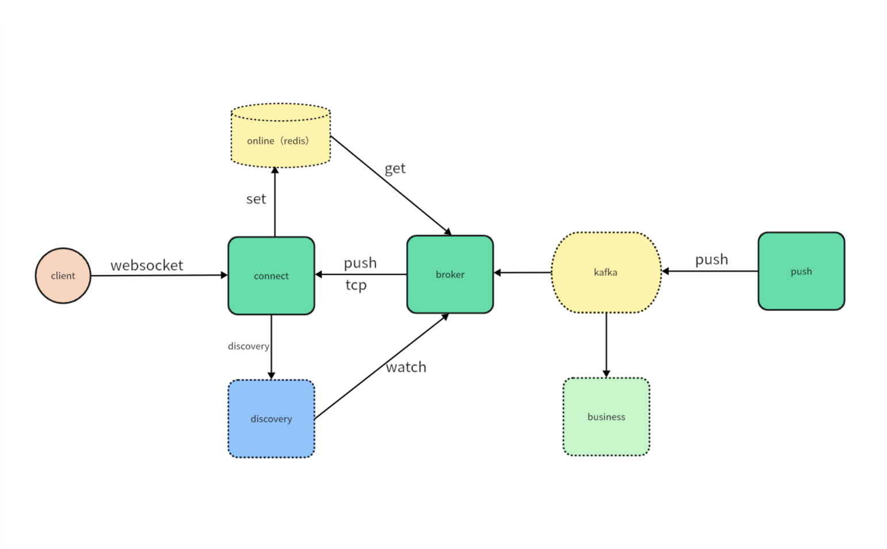

#### 介绍

websocket-cluster是一个基于springboot开发的websocket的分布式消息推送框架。

#### 软件架构

#### 项目结构

websocket-cluster  
├─example  
│ ├─broker-example  
│ ├─connect-example  
│ └─push-example  
├─websocket-cluster-broker-starter //broker模块，转发客户端消息到对应connect服务   
├─websocket-cluster-common //公共模块  
├─websocket-cluster-connect-starter //连接层，管理websocket连接  
└─websocket-cluster-push-starter // push模块，推送消息到kafka

#### 相关依赖

1. nacos 作为注册中心
2. redis 管理websocket连接路由信息
3. kafka 消息推送异步化

#### 声明

本项目未经生产环境验证，请勿用于生产环境，仅供学习交流使用。产生的一切后果自行承担。

